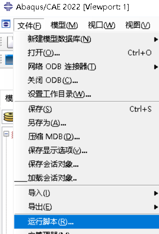
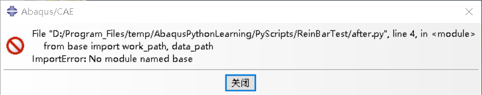
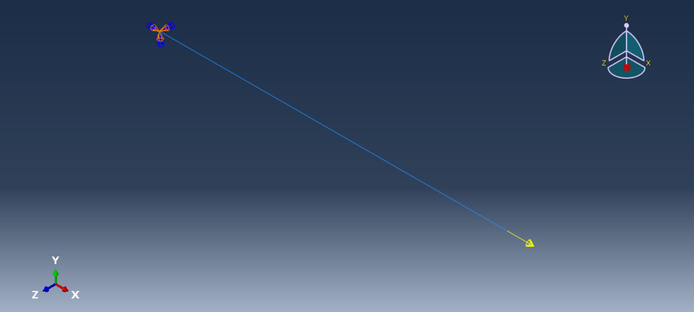

# 3维-可变形 钢筋单侧受拉模拟 （基础脚本编写）

在 ABAQUS 中，运行 GUI 后，可以发现工作目录下自动生成了一个名为 abaqus.rpy 的文件，该文件记录用户在 GUI 界面中的各种操作，转换成对应的 Python 代码，因此尽管没有了解或者系统学习相关二次开发，依旧可以通过在 GUI 中完成模拟过程，然后提取 abaqus.py 的核心操作代码，扩展或续写出需要的 ABAQUS 脚本程序。

接下来，将从钢筋的拉伸模拟来讨论 ABAQUS 二次开发的流程。

## 通用

### 1. 脚本启动方式

#### 无 GUI 启动

1. Python IDE 直接执行，比如 Pycharm 中通过点击运行的方式执行脚本。

2. Python IDE 间接执行，通过另外一个 .py 文件执行需要运行的脚本。
    ``` python
    from abaqus import *
    
    execfile('./xx.py')
    ```
   
3. 终端启动，输入以下命令，并将 "*" 替换为对于的脚本名称。
   ``` commandline
   abaqus cae noGUI=*.py
   ```
   
#### GUI 启动

1. GUI 下，可以通过打开 ABAQUS CAE, 点击 文件 > 运行脚本 执行.py文件。
   <p align = "center">    
   
   </p>
   
2. 也可以使用终端输入脚本名称启动：
   ``` commandline
   abaqus cae script=*.py
   ```
   
3. 使用 ABAQUS 2022 自带的 PDE 运行。（PDE 是内置的 Python IDE, 在没有其他 IDE 时，可以直接使用它编辑或运行脚本）
   
   > 注: 在使用 GUI 运行脚本时候，如果脚本使用了相对路径导入了其他模块，则需要确保 ABAQUS 工作目录与项目的根目录一致，才能找模块。否则，可能触发类似如下的导入错误：

4. 对于 GUI 运行的脚本，可以使用如下代码将自动生成的 .rpy 文件中，获取位置的方式从掩码改成坐标，自动生成的代码可读性更强，方便后续脚本的编辑。
   
   ``` python
   session.journalOptions.setValues(replayGeometry=COORDINATE, recoverGeometry=COORDINATE)
   ```


### 2. 编码

对于一个 ABAQUS 脚本文件，采用 Python2 的代码风格，通常在首行进行如下编码声明。
``` python
# -*- coding: mbcs -*-
```
    
然而对于一个中文的 ABAQUS 脚本而言，使用这个编码，中文字符将会出现乱码的现象。 为解决这个问题，建议使用如下编码声明：
``` python
# coding=cp936
```

CP936 是一种 Windows 中常用的字符编码，它是 GBK 编码的别名，也就是简体中文编码。

## 前处理

### 1. 导入库

``` python
from abaqus import *
from abaqusConstants import *
from caeModules import *
```

abaqus 储存基本的abaqus对象， abaqusConstants 包括了所有常量，这两个库是前处理脚本的核心，caeModules 是 cae 模组，包括网格、集处理方法等。

``` python
import math
```

为计算钢筋截面面积，需要导入内置库 math

### 2. 创建模型

在导入基础对象后，我们可以使用mdb对象 (ModelDataBase 模型数据库) 访问或者创建模型。默认情况下，一个新的 mdb 有一个默认的模型，可以通过如下方式访问，也可以直接索引它的名字 'Model-1'

``` python
model = mdb.models[mdb.models.keys()[0]]
# model = mdb.models['Model-1']
```
  
### 3. 创建部件
   
假设钢筋的长度为100mm，创建钢筋部件的代码如下：

``` python
# 钢筋长
length = 100
x = length / 2
   
# 草图
skh = model.ConstrainedSketch(name='__profile__', sheetSize=1.2 * length)
   
# 绘制
skh.Line(point1=(-x, 0.0), point2=(x, 0.0))
   
# 生成部件
part = model.Part(name='ReinBar', dimensionality=THREE_D, type=DEFORMABLE_BODY)
part.BaseWire(sketch=skh)
   
# 删除草图
del model.sketches[skh.name]
```

这将生成一个3维可变形线部件，在生成部件后需要删除临时的草图。

### 4. 材料属性与截面

定义材料属性，钢筋采用HRB400级钢筋，包括通用属性（密度），弹性属性（弹性模量和泊松比），塑性属性。

``` python
# 钢材名称
material_name = 'HRB400'
# 密度
rho = 7.85e-09
# 弹性模量
e = 2e5
poisson = 0.3
# 屈服强度
yie = 400.0
# 极限强度
limit = 540

# 材料
hrb400 = model.Material(name=material_name)
hrb400.Density(table=((rho,),))
hrb400.Elastic(table=((e, poisson),))
hrb400.Plastic(scaleStress=None, table=((yie, 0.0), (limit, 0.1)))
```

塑性属性采用钢筋双折线模型。
<p align = "center">    

</p>


创建桁架截面，根据钢筋直径计算截面面积。

``` python
# 钢筋直径
d = 8
<<<<<<< HEAD
area = (d / 2) ** 2 * math.pi 
=======
area = (d / 2) ** 2 * math.pi
>>>>>>> 68e8814 (Fix Bug)
# 截面
section_name = 'TrD%d' % d + material_name
model.TrussSection(name=section_name, material=hrb400.name, area=area)
# 截面指派
set_all = part.Set(edges=part.edges, name='All')
part.SectionAssignment(region=set_all, sectionName=section_name, offsetType=MIDDLE_SURFACE, )
```

region 需要提供一个 Set (集合), 如果不希望创建集合，则可以使用 regionToolset.Region

``` python
region = regionToolset.Region(edges=part.edges)
part.SectionAssignment(region=region, sectionName=section_name, offsetType=MIDDLE_SURFACE, )
```

### 5. 装配

创建一个独立的部件实例对象，可以通过调用实例对象的函数如 translate、rotateAboutAxis 进行平移和旋转操作，也可通过调用装配对象 (model.rootAssembly) 进行平移、旋转，此外，后者还支持阵列。


``` python
assem = model.rootAssembly
instance = assem.Instance(name=part.name + '-1', part=part, dependent=ON)
```

### 6. 分析步

分析步这里设置一步，初始增量步0.01，时间长度为 2，最大增量步不大于时间长度。

``` python
step1 = model.StaticStep(name='Step-1', previous='Initial', initialInc=0.01, timePeriod=2, maxInc=2)
```

### 7. 边界条件和荷载

模拟的受力情况为，在右侧完全固定的前提下，左侧受 30kN 拉力。

``` python
# 边界条件
set_right = part.Set(vertices=part.vertices.getByBoundingBox(xMax=-x), name='Right')
model.DisplacementBC(name='BC-1',
                     createStepName=step1.name,
                     region=instance.sets['Right'],
                     u1=SET, u2=SET, u3=SET, ur1=SET, ur2=SET, ur3=SET)
# 荷载
load_force = 30000.0
set_left = part.Set(vertices=part.vertices.getByBoundingBox(xMin=x), name='Left')
model.ConcentratedForce(name='Load-CF',
                        createStepName=step1.name,
                        region=instance.sets['Left'],
                        cf1=load_force)
```

部件 part 的属性中，顶点 (vertices)、 面 (faces)、 边 (edges)、 单元 (cells) 等均有按尺寸、位置或者临界条件获取对象的方式，如上述代码中的 vertices.getByBoundingBox(xMax=-x)，将会将小于等于-x的点筛选出来，而符合条件的仅有-x位置的点，故通过这种方式可以获得最右侧顶点，同时，和findAt不同，这个函数可以返回对象是符合要求的序列。

由部件创建的集合不能直接传给边界条件和荷载的 region, 因为我们是在实例上施加的荷载和边界条件。

### 8. 输出

``` python
model.FieldOutputRequest(name='F-Output-1',
                         createStepName=step1.name, variables=('S', 'E'), timeInterval=0.05,
                         position=NODES)
```

场输出结点，输出变量为应力 S, 应变 E

### 9. 网格

``` python
# 网格大小
mesh_size = 8.0

# 网格
part.seedPart(size=mesh_size, deviationFactor=0.1, minSizeFactor=0.1)
t3d2 = mesh.ElemType(elemCode=T3D2, elemLibrary=STANDARD)
part.setElementType(regions=regionToolset.Region(edges=part.edges), elemTypes=(t3d2,))
part.generateMesh()
```
设置网格大小和网格属性，桁架截面采用T3D2单元，元素类型要与截面类型相适配，不适配将触发元素缺失截面错误。

> 13 elements have missing property definitions. The elements have been identified in element set ErrElemMissingSection.

### 10. 作业

创建作业并提交。

``` python
job = mdb.Job(name='Job-1', model=model)
job.submit(consistencyChecking=OFF)
```


<p align="center">钢筋模型示意图</p>

### 总结

完整的前处理建模过程代码见 [before.py](../PyScripts/ReinBarTest/before.py)，加入了一个 [base.py](../PyScripts/base.py) 模块，它将追溯第一次调用它的脚本文件所在目录，创建存放 cae、odb 等文件的 Results 文件夹和用于存放 csv、图像的子文件夹 Data、Img, 通过这种方式统一各种前后处理文件的生成路径。
``` python
from base import *
```

## 后处理

### 1. 导入

在考虑了一些可能出现的绘图问题，将数据提取和绘图的代码区分开，放在不同的 py 文件，由 [after.py](../PyScripts/ReinBarTest/after.py) 提取钢筋的应力应变数据，保存 . csv文件到 [base.py](../PyScripts/base.py) 指定的目录中。

``` python
# coding=cp936
import csv
import numpy as np
from odbAccess import openOdb
from base import data_path
```

为打开 ODB 文件需要从 odbAccess 中导入 openOdb 函数。

### 2. 提取数据

``` python
# 打开odb
odb = openOdb(path)
node = odb.rootAssembly.instances['REINBAR-1'].nodeSets['LEFT']

# 应力、应变
s_max = np.array([])
e_max = np.array([])

# 提取数据
for step in odb.steps.values():
    for frame in step.frames:
        s_out = frame.fieldOutputs['S']
        e_out = frame.fieldOutputs['E']

        s_max = np.append(s_max, s_out.getSubset(region=node).values[0].maxPrincipal)
        e_max = np.append(e_max, e_out.getSubset(region=node).values[0].maxPrincipal)
```
打开 ODB 后，通过遍历分析步和帧，获取每一帧的场数据，从全部的场数据中筛选出指定的结点的最大主拉、压应力数据。注意的是，因为前处理中指定了场输出的是结点数据，所以在后处理中可以用 getSubset 获取到某实例结点集的数据，如果场输出的是积分点的数据，则使用 getSubset 虽然能找到该点，但数据为空集。

完整的后处理建模过程代码见 [after.py](../PyScripts/ReinBarTest/after.py)

### 3. 绘图
 [plot.py](../PyScripts/ReinBarTest/plot.py)  使用 pandas 获取 csv 文件数据，绘制的钢筋应力应变曲线如下图所示：


<p align = "center">    

</p>

可以看到图像呈现双折线的特点，应力在400MPa以下钢筋处于弹性阶段，应力达到屈服强度时，应变也接近0.002左右，之后钢筋屈服，曲线斜率明显发生变化，直到达到极限强度540MPa.